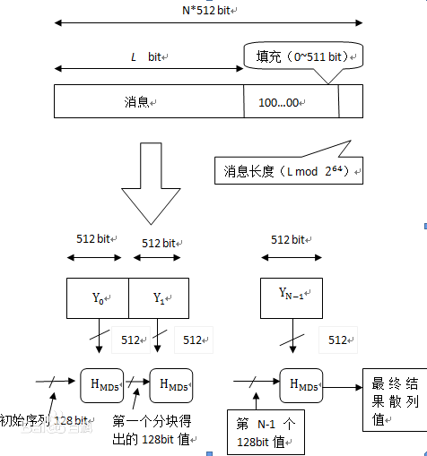
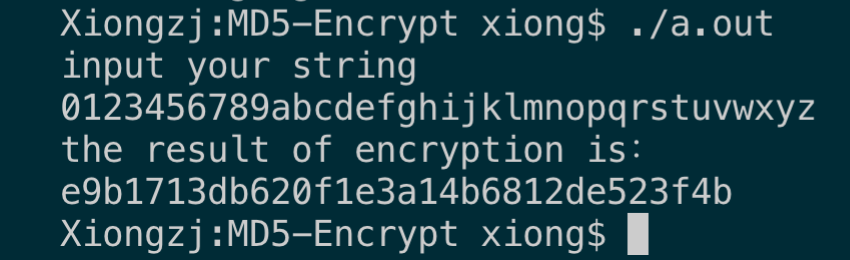
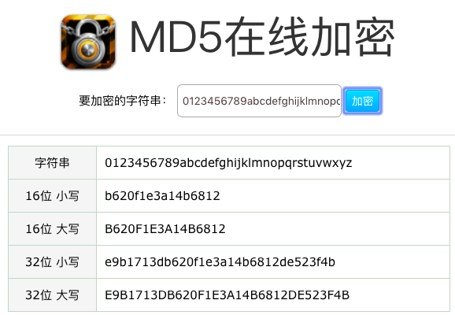

# MD5算法加密实验报告
## 什么是MD5算法
首先，我们需要了解MD5算法这个概念。那么什么是MD5算法呢？MD5讯息摘要算法又称 MD5 Message-Digest Algorithm，是一种被广泛使用的密码杂凑函数，可以产生一个128bit（即32位byte）的散列值，用于确保信息传输完整一致
## MD5功能
输入任意长度的信息，经过多步处理，输出为128位的信息，和人类的指纹相类似，不同的输入得到的一定是不同的输出
## MD5用途
1.防止被篡改
* 比如发送一个电子文档，发送前，首先发送者得到该文件的MD5的输出结果。然后接收者在收到电子文档之后，对方也能得到一个MD5的输出结果。如果二者得到的MD5的输出结果相同的话就说明该电子文档并没有被篡改
* 下载提供商为了防止不法分子在安装程序中植入病毒，有的会在网站上公布由安装文件得到的MD5的输出结果，以防电脑被攻击
* SVN在检测文件是否在CheckOut后被修改过，也可以运用MD5

2.防止直接看到明文 
* 现在很多网站在数据库存储用户的密码的时候，都是存储用户的MD5的值而并不会直接去存用户密码的文本的。这样就算是黑客得到了用户密码的MD5值，也无法知道用户的密码。用户在登录的时候，系统只需要将用户输入的密码的MD5值和存储在数据库中的MD5值进行比对就行了，这样同时也防止了内部的恶意人员的攻击和破坏。

3.防止抵赖
* 假设这样一种场景，存在一个第三方认证机构和一个客户A。再假设A写了一个文件，认证机构对此文件用MD5算法产生摘要信息并做好记录。若以后A说这个文件不是他写的，权威机构只需对此文件重新生成摘要信息，然后跟记录在册的摘要信息进行比对，相同的话，就证明一定是A写的了。这样的技术可用于用户授权、电子合同等多方面的应用之上

## MD5算法概述
根据百度百科上的算法概述，可以这样来解释：MD5以512位分组来处理输入的信息，且每一个分组又被划分为16个32位的子分组，经过了一系列的处理后，算法的输出由四个32位分组组成，将这四个32位分组级联后将生成一个128位的散列值。

## 总体结构
这是一张MD5加密算法的总体流程图


## 模块分解
根据MD5算法的概述和总体的流程图，我们可以将整个过程分为四个部分来完成。以下将简单说明这四个步骤需要做的事情。

1.填充输入的信息

当用户选择了一个文件或者输入了一些信息的时候，我们首先需要对该输入信息进行填充使得它符合MD5算法的要求。具体的要求是：如果输入信息(bit)对512求余的结果不等于448，就需要填充使得对512求余的结果等于448.填充的方法是填充一个1和若干个0.然后再在信息的末尾加上用64位来表示的填充前输入信息的长度。

2.装入标准的幻数

标准的幻数(物理顺序)：A=(01234567)16、 B=(89ABCDEF)16、C=(FEDCBA98)16、D=(76543210)16
如果在程序中定义的话就应该是：
A=0X67452301L、B=0XEFCDAB89L、C=0X98BADCFEL、D=0X10325476L

3.四轮循环运算，循环的次数是分组的个数(N+1）

* 将每一个512位细分成16个小组，每个小组就是64位(8个字节)


* 这里需要了解一下四个线性函数
    ```c++
    #define F(x, y, z) (((x) & (y)) | ((~x) & (z)))    
#define G(x, y, z) (((x) & (z)) | ((y) & (~z)))
#define H(x, y, z) ((x) ^ (y) ^ (z))
#define I(x, y, z) ((y) ^ ((x) | (~z)))
    ```
    
* 设Mj表示信息的第j个子分组(0-15)，那么我们需要做这样的运算
    ```c++
    /*
    FF(a,b,c,d,Mj,s,ti)表示a=b+((a+F(b,c,d)+Mj+ti)<<<s)
    GG(a,b,c,d,Mj,s,ti)表示a=b+((a+G(b,c,d)+Mj+ti)<<<s)
    HH(a,b,c,d,Mj,s,ti)表示a=b+((a+H(b,c,d)+Mj+ti)<<<s)
    II(a,b,c,d,Mj,s,ti)表示a=b+((a+I(b,c,d)+Mj+ti)<<<s)
    */
    #define FF(a, b, c, d, x, s, ac) { \
  (a) += F ((b), (c), (d)) + (x) + ac; \
  (a) = shift ((a), (s)); \
  (a) += (b); \
}
#define GG(a, b, c, d, x, s, ac) { \
  (a) += G ((b), (c), (d)) + (x) + ac; \
  (a) = shift ((a), (s)); \
  (a) += (b); \
}
#define HH(a, b, c, d, x, s, ac) { \
  (a) += H ((b), (c), (d)) + (x) + ac; \
  (a) = shift ((a), (s)); \
  (a) += (b); \
}
#define II(a, b, c, d, x, s, ac) { \
  (a) += I ((b), (c), (d)) + (x) + ac; \
  (a) = shift ((a), (s)); \
  (a) += (b); \
}
    ```
    
* 四轮运算
利用上一步我们所提到的四种运算，我们需要对对应的存有幻数的变量进行64轮运算，最后再将四个变量的值记录下来。

4.将上一步记录的四个变量的值进行十六进制的转换，再将得到的四个字符串拼接起来，即可得到最后的加密文本。

## 数据结构
根据总体结构和模块分解，我的数据结构是这样划分的。明文首先进入encrypt()函数，在该函数里调用填充函数fillData()，得到符合要求的字符串。然后在encrypt()函数里面对得到的字符串进行分组，再将一个分组划分成子分组，对每个分组进行mainLoop()处理，在所有的分组都进行过mainLoop()处理之后，将我们记录下来的四个变量进行十六进制的转换，得到最后的密文。
```c++
class MD5{
    public:
        string ciphertext = "";
        string encrypt(std::string plaintext);
    private:
        // strByte的长度
        unsigned int strlength;
        // 四个临时变量
        unsigned int tempA;
        unsigned int tempB;
        unsigned int tempC;
        unsigned int tempD;
        const char str16[17] = "0123456789abcdef";
         /*
	  *填充函数
	  *处理后应满足bits≡448(mod512),字节就是bytes≡56（mode64)
	  *填充方式为先加一个1,其它位补零
	  *最后加上64位的原来长度
	  */
        unsigned int* fillData(string initialtext);

        void mainLoop(unsigned int M[]);
        //转换为16进制数 
        string changeHex(long number);
};
```

## 源代码(函数实现)
```c++
string MD5::encrypt(string plaintext){
    tempA = A;
    tempB = B;
    tempC = C;
    tempD = D;
    unsigned int* strByte = fillData(plaintext); // here we can get (N+1)*512 bits, equle to (N+1)*64 bytes
    // 先把(N+1)*512 bits 按照 512 bits一组来进行分组（也就是16个int一组）
    // 然后每一分组被划分为16个32位子分组
    // 一个int是4个字节，32个bit(位)
    // 所以说一个分组被划分成16个32位子分组也就是16个int, 为16组
    for(unsigned int i = 0;i < strlength / 16; i++){ // 首先是按照512 bits来分组
        unsigned int num[16]; // 代表一个分组的16个int, 我们把这个分组的16个int给取出来
        for(unsigned int j = 0;j < 16;j++){
            num[j] = strByte[i * 16 + j]; // i * 16 代表第几组， j 代表该组中的第几位
        }
        mainLoop(num);
    }
    ciphertext += changeHex(tempA);
    ciphertext += changeHex(tempB);
    ciphertext += changeHex(tempC);
    ciphertext += changeHex(tempD);
    return ciphertext;
}
unsigned int* MD5::fillData(string initialtext){
    // 首先我们需要确定(N+1) * 512 bits 里的这个N的值
    // 假设 m 是补位的位数， 那么原字符串加上源字符串的的64位表达可以表示为： (N + 1) * 512 - m
    // m 是小于512的一个数
    // [(N + 1) * 512 - m] / 512 = N
    // 我们这里使用字节运算，不用位来进行运算
    unsigned int num = ((initialtext.length() + 8) / 64) + 1; // 这里num = N + 1
    unsigned int* strByte =  new unsigned int[num * 16];
    strlength = num * 16; // 这里我们可以确认填充后的字符串的int的位数
    for(unsigned int i = 0; i < num * 16; i++) { // 先全部设置为0
        strByte[i] = 0;
    }
    // 因为strByte是unsigned int*的， 一个unsigned int 四个字节
    // 而initialtext是一个字符串，一个字符是一个字节，所以一个unsigned int存四个字符
    // i >> 2代表的是 i / 4， 也就是找到字符所对应的unsigned int
    // (i % 4) * 8 就是找到这个字符在unsigned int中所对应的那个字节
    // 然后移位使得该字节移动到对应的字节上面去
    for(unsigned int i = 0; i < initialtext.length(); i++){
        strByte[i >> 2] |= (initialtext[i]) << ((i % 4) * 8);
    }
    // 0x80是二进制的10000000，我们在原来字符串的后面接上一个10000000
    // 至于说后面还要跟多少个0，这我们就不用担心了
    // 因为前面我们在初始化strByte的时候，就已经决定了总长度并将每一位都初始化为0了
    // 所以我们只需要将该赋值的位赋值，其余的位就不需要我们管了
    strByte[initialtext.length() >> 2] |= 0x80 << (((initialtext.length() % 4)) * 8);
    // 这里我们需要在填充字符串的末尾加上原字符串的长度的64位表达， 所以 * 8表示了位的长度
    // 这里只使用了32位，所以可能还存在一些问题，以后再说
    strByte[num * 16 - 2] = initialtext.length() * 8;
    return strByte;
}

void MD5::mainLoop(unsigned int M[]){
    unsigned a = tempA;
    unsigned b = tempB;
    unsigned c = tempC;
    unsigned d = tempD;
    /*
    FF(a,b,c,d,Mj,s,ti)表示a=b+((a+F(b,c,d)+Mj+ti)<<<s)
    GG(a,b,c,d,Mj,s,ti)表示a=b+((a+G(b,c,d)+Mj+ti)<<<s)
    HH(a,b,c,d,Mj,s,ti)表示a=b+((a+H(b,c,d)+Mj+ti)<<<s)
    II(a,b,c,d,Mj,s,ti)表示a=b+((a+I(b,c,d)+Mj+ti)<<<s) */
     /* Round 1 */
    FF (a, b, c, d, M[0], s11, 0xd76aa478);
    FF (d, a, b, c, M[1], s12, 0xe8c7b756);
    FF (c, d, a, b, M[2], s13, 0x242070db);
    FF (b, c, d, a, M[3], s14, 0xc1bdceee);
    FF (a, b, c, d, M[4], s11, 0xf57c0faf);
    FF (d, a, b, c, M[5], s12, 0x4787c62a);
    FF (c, d, a, b, M[6], s13, 0xa8304613);
    FF (b, c, d, a, M[7], s14, 0xfd469501);
    FF (a, b, c, d, M[8], s11, 0x698098d8);
    FF (d, a, b, c, M[9], s12, 0x8b44f7af);
    FF (c, d, a, b, M[10], s13, 0xffff5bb1);
    FF (b, c, d, a, M[11], s14, 0x895cd7be);
    FF (a, b, c, d, M[12], s11, 0x6b901122);
    FF (d, a, b, c, M[13], s12, 0xfd987193);
    FF (c, d, a, b, M[14], s13, 0xa679438e);
    FF (b, c, d, a, M[15], s14, 0x49b40821);

    /* Round 2 */
    GG (a, b, c, d, M[ 1], s21, 0xf61e2562);
    GG (d, a, b, c, M[ 6], s22, 0xc040b340);
    GG (c, d, a, b, M[11], s23, 0x265e5a51);
    GG (b, c, d, a, M[ 0], s24, 0xe9b6c7aa);
    GG (a, b, c, d, M[ 5], s21, 0xd62f105d);
    GG (d, a, b, c, M[10], s22,  0x2441453);
    GG (c, d, a, b, M[15], s23, 0xd8a1e681);
    GG (b, c, d, a, M[ 4], s24, 0xe7d3fbc8);
    GG (a, b, c, d, M[ 9], s21, 0x21e1cde6);
    GG (d, a, b, c, M[14], s22, 0xc33707d6);
    GG (c, d, a, b, M[ 3], s23, 0xf4d50d87);
    GG (b, c, d, a, M[ 8], s24, 0x455a14ed);
    GG (a, b, c, d, M[13], s21, 0xa9e3e905);
    GG (d, a, b, c, M[ 2], s22, 0xfcefa3f8);
    GG (c, d, a, b, M[ 7], s23, 0x676f02d9);
    GG (b, c, d, a, M[12], s24, 0x8d2a4c8a);

    /* Round 3 */
    HH (a, b, c, d, M[ 5], s31, 0xfffa3942);
    HH (d, a, b, c, M[ 8], s32, 0x8771f681);
    HH (c, d, a, b, M[11], s33, 0x6d9d6122);
    HH (b, c, d, a, M[14], s34, 0xfde5380c);
    HH (a, b, c, d, M[ 1], s31, 0xa4beea44);
    HH (d, a, b, c, M[ 4], s32, 0x4bdecfa9);
    HH (c, d, a, b, M[ 7], s33, 0xf6bb4b60);
    HH (b, c, d, a, M[10], s34, 0xbebfbc70);
    HH (a, b, c, d, M[13], s31, 0x289b7ec6);
    HH (d, a, b, c, M[ 0], s32, 0xeaa127fa);
    HH (c, d, a, b, M[ 3], s33, 0xd4ef3085);
    HH (b, c, d, a, M[ 6], s34,  0x4881d05);
    HH (a, b, c, d, M[ 9], s31, 0xd9d4d039);
    HH (d, a, b, c, M[12], s32, 0xe6db99e5);
    HH (c, d, a, b, M[15], s33, 0x1fa27cf8);
    HH (b, c, d, a, M[ 2], s34, 0xc4ac5665);

    /* Round 4 */
    II (a, b, c, d, M[ 0], s41, 0xf4292244);
    II (d, a, b, c, M[ 7], s42, 0x432aff97);
    II (c, d, a, b, M[14], s43, 0xab9423a7);
    II (b, c, d, a, M[ 5], s44, 0xfc93a039);
    II (a, b, c, d, M[12], s41, 0x655b59c3);
    II (d, a, b, c, M[ 3], s42, 0x8f0ccc92);
    II (c, d, a, b, M[10], s43, 0xffeff47d);
    II (b, c, d, a, M[ 1], s44, 0x85845dd1);
    II (a, b, c, d, M[ 8], s41, 0x6fa87e4f);
    II (d, a, b, c, M[15], s42, 0xfe2ce6e0);
    II (c, d, a, b, M[ 6], s43, 0xa3014314);
    II (b, c, d, a, M[13], s44, 0x4e0811a1);
    II (a, b, c, d, M[ 4], s41, 0xf7537e82);
    II (d, a, b, c, M[11], s42, 0xbd3af235);
    II (c, d, a, b, M[ 2], s43, 0x2ad7d2bb);
    II (b, c, d, a, M[ 9], s44, 0xeb86d391);
    tempA = a + tempA;
    tempB = b + tempB;
    tempC = c + tempC;
    tempD = d + tempD;
}
//转换为16进制数 
string MD5::changeHex(long number){
    string str;
    int temp;
    while(number != 0){
        temp = number % 16;
        number /= 16;
        str += str16[temp];
    }
    string reverseStr(str.rbegin(), str.rend());  // u can get 4d1, and correct result is d1040000
    //cout << "reverse: " << reverseStr << endl;
    string result = "";
    string temp1;
    string temp2;
    string temp3;
    string temp4;
    for(int i=0;i<8;++i){
        if(i < 8-reverseStr.length()){
            result += "0";
        }
        else {
            result += reverseStr[i+reverseStr.length()-8];
        }
    }
    // 000004d1
    temp1 += result.substr(0,2); // 00
    temp2 += result.substr(2,2); // 00
    temp3 += result.substr(4,2); // 04
    temp4 += result.substr(6,2); // d1
    string changeResult = temp4 + temp3 + temp2 + temp1;
    //cout << "result is: " << result << endl;
    return changeResult;
}
```

## 编译运行结果




